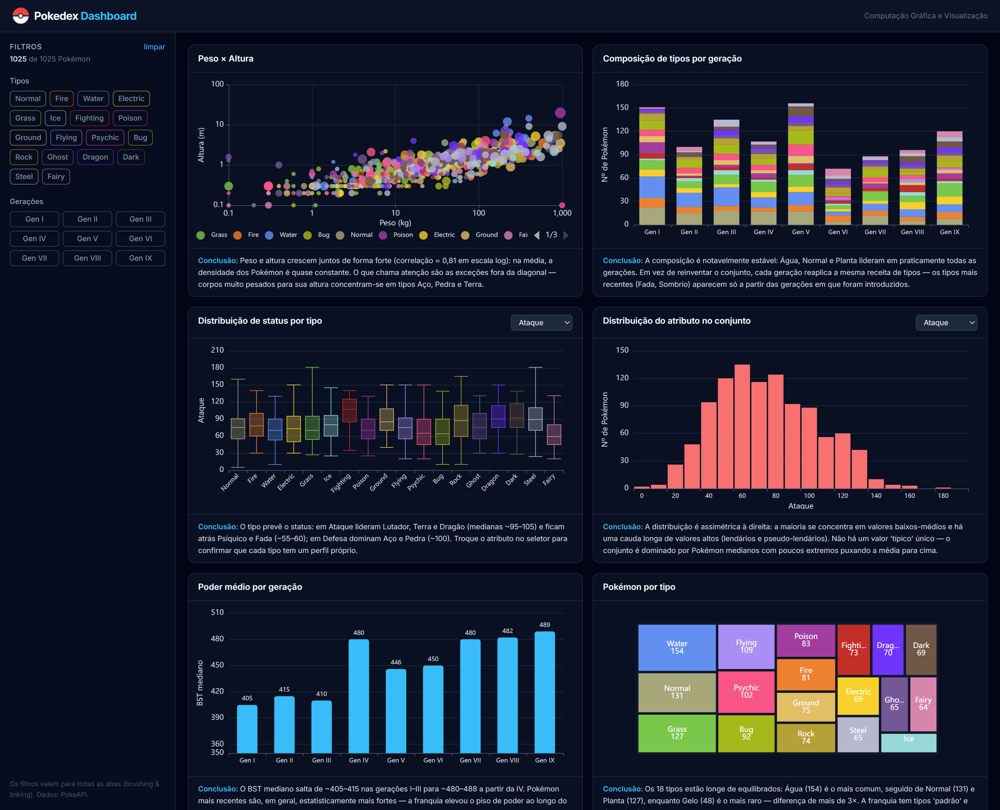

# Relatório

> [!CAUTION]
>
> - Você <ins>**não pode utilizar ferramentas de IA para escrever este relatório**</ins>.

## Identificação

- **Nome**: <mark>`João Vitor de Medeiros Cardoso`</mark>
- **Cartão UFRGS:** <mark>`00270044`</mark>

## Dados utilizados

> [!IMPORTANT]
>
> - Os dados utilizados devem ser informados como **links** para as fontes originais.
> - Se houver mais de um conjunto de dados, liste todos separadamente.
> - Para cada conjunto de dados, inclua também uma **descrição curta** explicando os dados.

1. **Dataset 1**: <mark>`https://pokeapi.co/`</mark>
    * **Descrição curta**: <mark>`API pública e gratuita com dados das nove gerações de Pokémon. Deste fonte extraí 1025 Pokémon (formas padrão das gerações I–IX), com os campos: número e nome, tipo(s), os 6 status base (HP, Ataque, Defesa, Ataque Especial, Defesa Especial, Velocidade), o total desses status (BST), peso, altura, experiência-base e geração de origem. Os dados foram pré-processados uma vez (via GraphQL) e versionados como JSON estático em pokedex-dashboard/public/data/pokemon.json, evitando dependência de rede/rate-limit.`</mark>

## Código-fonte da visualização

> [!IMPORTANT]
>
> - Indique abaixo onde está, dentro deste repositório, o código-fonte usado para gerar a visualização.

- **Arquivo principal**: <mark>`pokedex-dashboard/src/pages/Overview.tsx`</mark>
- **Arquivos complementares (se houver)**: <mark>`
- pokedex-dashboard/src/charts/(ScatterWeightHeight, TypeByGenStacked, StatBoxPlot, StatHistogram, BstByGeneration, TypeTreemap)
- pokedex-dashboard/src/data/meta.ts — cores dos tipos, rótulos de status e gerações
- pokedex-dashboard/src/lib/stats.ts — funções estatísticas (mediana, quartis, histograma)
- pokedex-dashboard/src/store/useFilters.ts — filtros globais (tipo e geração)
- pokedex-dashboard/scripts/build-dataset.ts — script de ETL que gera o JSON a partir da PokeAPI
`</mark>

## Imagem da visualização gerada

> [!IMPORTANT]
>
> - Insira aqui uma imagem da visualização criada por você. Troque `imagem-da-visualizacao.png` pelo caminho correto do arquivo no repositório. 
> - Se você criou alguma visualização interativa, então descreva aqui como acessá-la. Por exemplo, se for uma página HTML, coloque o link, ou se for uma visualização 3D, descreva como compilar e executar o código. 

<mark>

A visualização é interativa. Para executar localmente, a partir da raiz deste repositório:

```bash
cd pokedex-dashboard
npm install
npm run dev
```

Depois, abra <http://localhost:5173> no navegador. Os dados já estão versionados em `pokedex-dashboard/public/data/`, então não é necessário acesso à internet para rodar.



</mark>

## Descrição da visualização

### Legenda (*caption*)

> [!IMPORTANT]
>
> - Escreva um texto curto explicando como interpretar a visualização. Descreva os elementos visuais, eixos, cores, símbolos ou interações relevantes.
> - Este texto seria a legenda (*caption*) que acompanharia a figura em uma publicação, por exemplo.

<mark>`Painel com seis visualizações dos 1025 Pokémon das gerações I–IX. A cor codifica de forma consistente o tipo em todos os gráficos (mesma cor = mesmo tipo). 
Os gráficos: 
1. Dispersão Peso × Altura em eixos logarítmicos, com tamanho do ponto proporcional à experiência-base;
2. Barras empilhadas da composição de tipos por geração (cada Pokémon contado pelo tipo primário); 
3. Box plot da distribuição de um status (selecionável) por tipo, mostrando mediana; 
4. Histograma da distribuição do mesmo status no conjunto; 5. Barras da mediana do BST por geração; 
6. Treemap com a quantidade de Pokémon por tipo (área proporcional à contagem, considerando os dois tipos). 
A barra lateral permite filtrar por tipo e geração, atualizando todas as visões ao mesmo tempo (brushing & linking).`</mark>

### Conclusão demonstrada pela visualização

> [!IMPORTANT]
>
> - Escreva uma conclusão curta sobre os dados com base na visualização.
> - Explique qual insight, padrão ou tendência pode ser observado.

<mark>`
1. Peso × Altura: crescem juntos (correlação ≈ 0,81); exceções pesadas demais para a altura são tipos Aço, Pedra e Terra.
2. Tipos por geração: composição estável. Água, Normal e Planta lideram em quase todas as gerações.
3. Status por tipo: o tipo prevê o status. Lutador/Terra/Dragão atacam mais; Aço/Pedra defendem mais.
4. Distribuição do atributo: assimétrica à direita. Maioria mediana, com uma cauda de valores altos (lendários).
5. Poder por geração: o BST mediano sobe de ~405 (gen I–III) para ~480+ (gen IV em diante) — Pokémon mais novos são mais fortes.
6. Pokémon por tipo: tipos desbalanceados. Água é o mais comum (154) e Gelo o mais raro (48), diferença de +3×.
`</mark>
